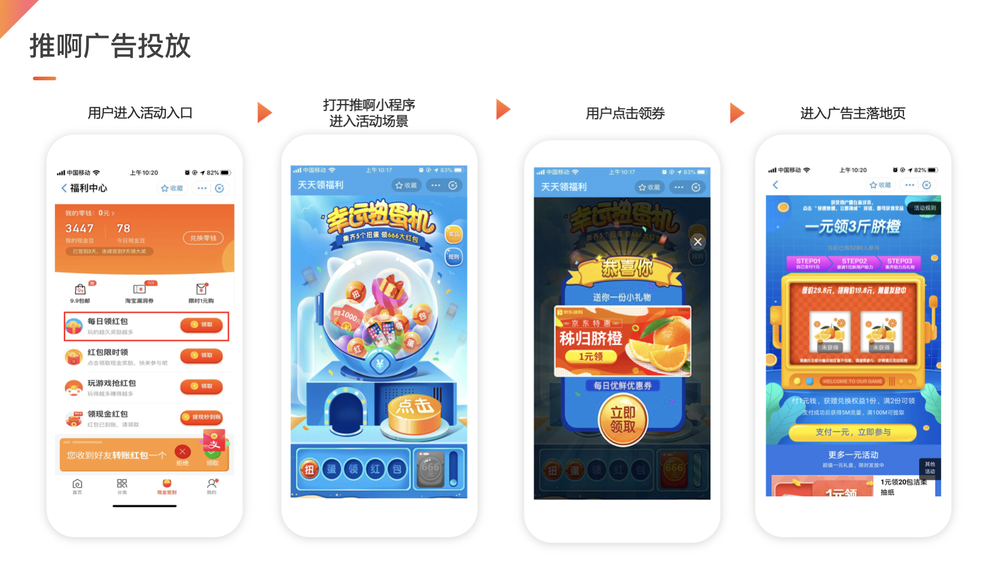

# 互动小程序媒体对接

<!-- ## 产品介绍
 -->

## 类型一：使用WebView组件打开互动广告

### 业务域名添加

互动业务域名：
- https://engine.aoclia.com
- https://tui.yiyhua.cn

为保证WebView组件能够打开互动业务域名，须添加小程序信任文件到互动业务服务器，以及将互动业务域名添加进小程序业务域名中。


### 基础实现代码样例
- wxml
  ```html
  <view>
    <web-view src="{{url}}" binderror="loadError" bindload="loadSuccess" />
  </view>
  ```
- 方式一：js（通过appKey和adslotId方式打开）
  ```javascript
  Page({
    data: {
      url: '',
    },
    onLoad(options) {
      wx.showLoading({
        title: '页面加载中...'
      })

      const params = {
        appKey: '', // 必传 your appKey
        adslotId: '', // 非必传 your adslotId
        device_id: '', // 非必传 用户设备ID Andriod:imei;iOS:idfa
        userId: '', // 非必传 用户唯一标识（涉及虚拟奖品发放时需要传）
      }
      function serialize(obj) {
        return Object.keys(obj)
          .map((key) =>
            obj[key] === null || obj[key] === undefined
              ? ''
              : key + '=' + obj[key]
          )
          .join('&');
      }

      this.setData({
        url: `https://engine.aoclia.com/index/activity?${serialize(params)}`
      })
    },
    loadError(e) {
      console.error(e)
      wx.hideLoading()
    },
    loadSuccess(e) {
      console.log(e)
      wx.hideLoading()
    }
  })
  ```
- 方式二：js（通过媒体后台获取URL方式）
URL类似如下：
https://engine.aoclia.com/index/activity?appKey=appKey&adslotId=adslotId
```javascript
  Page({
    data: {
      url: '',
    },
    onLoad(options) {
      wx.showLoading({
        title: '页面加载中...'
      })

      this.setData({
        url: `https://engine.aoclia.com/index/activity?appKey=appKey&adslotId=adslotId`
      })
    },
    loadError(e) {
      console.error(e)
      wx.hideLoading()
    },
    loadSuccess(e) {
      console.log(e)
      wx.hideLoading()
    }
  })
  ```

### 测试

对接完成后请体验整个广告流程（WebView 打开互动活动 -> 参加活动 -> 点击各类券 -> 进入落地页），如反复检验后仍有问题请联系我方开发


## 类型二：跳转到互动小程序

### 对接流程

- 合作方媒体在媒体平台 (https://ssp.tuia.cn) 注册账号
- 创建广告位，在后台获取 appKey、adslotId
- 在广告入口处进行小程序跳转

### 跳转互动小程序参数说明

- 互动小程序appId为

  `wx4645f4f355c0521a`

- 互动小程序跳转的path为

  `pages/activity/index`

- 跳转时需要携带的参数 **<font color="red">具体参考《媒体API对接文档2.1.4版 》</font>**

  |  参数名称   | 参数定义  |  是否必传  |
  |  ----  | ----  |  ----  |
  | appKey  | 媒体的Key（从媒体平台获取） |  必传  |
  | adslotId  | 广告位id（从媒体平台获取） |  必传  |
  | userId  | 当前用户在媒体系统的唯一标识符（不能含特殊字符如<,%） |  非必传（涉及虚拟奖品发放时需要传）  |
  | device_id  | 当前用户设备号，Andriod: imei, Ios: idfa(不能含特殊字符如<,%） |  保留字段，非必传  |

  > 注意：

  > appKey 或 adslotId 值传错，进入空白页面。


### 基础实现代码样例
  ```javascript
  const params = {
    appKey: '', // 必传 your appKey
    adslotId: '', // 必传 your adslotId
    device_id: '', // 非必传 用户设备ID Andriod:imei;iOS:idfa
    userId: '', // 非必传 用户唯一标识（涉及虚拟奖品发放时需要传）
  }
  function serialize(obj) {
    return Object.keys(obj)
      .map((key) =>
        obj[key] === null || obj[key] === undefined
          ? ''
          : key + '=' + obj[key]
      )
      .join('&');
  }
  const appConfig = {
    appId: 'wx4645f4f355c0521a',
    path: 'pages/activity/index?' + serialize(params),
    extraData: {},
    envVersion: 'release',
  }
  if (wx.navigateToMiniProgram) { // 兼容性处理
    wx.navigateToMiniProgram({
      ...appConfig,
      success(res) {
        console.log(res)
      },
      fail(res) {
        console.error(res)
      },
      complete(res) {
        console.log(res)
      }
    })
  } else {
    wx.showModal({
      title: '提示',
      content: '当前微信版本过低，无法使用该功能，请升级到最新微信版本后重试。'
    })
  }
  ```
  具体用法可以参见[wx.navigateToMiniProgram](https://developers.weixin.qq.com/miniprogram/dev/api/open-api/miniprogram-navigate/wx.navigateToMiniProgram.html)

# 媒体接入小程序广告

> 因为微信不允许H5直接打开小程序，所以需要通过小程序原生页面作为中转页面

## 物料准备

我方给媒体提供中转页面的压缩包，媒体解压之后可以看到如下资源

- pages/tuia/index.wxml
- pages/tuia/index.wxss
- pages/tuia/index.json
- pages/tuia/index.js

## 拷贝物料

将解压的物料拷贝到媒体小程序对应的文件夹内

## 添加路由

在app.json中加入中转页面的路由

```javascript
{
  "pages": [
    "pages/tuia/index"
  ],
}
```

## 配置服务器域名

在媒体小程序管理后台服务器域名中添加downloadFile合法域名（互动广告通过wx.getImageInfo接口来发送埋点信息）


## 小程序发布

媒体小程序正常发布之后，互动活动就可以正常发放小程序的广告了。   
体验流程：用户参与活动，用户点击弹层，如果是小程序广告，则打开中转页，用户在中转页发生点击行为，跳转到对应的广告小程序

