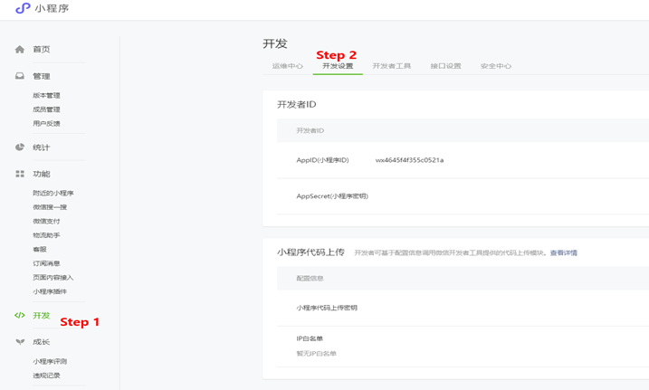
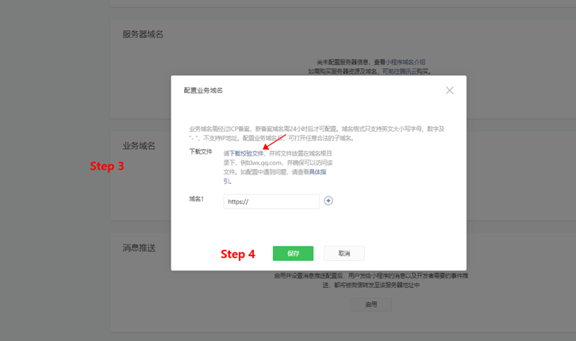

# 互动小程序媒体对接

合作方媒体在媒体平台 (https://ssp.tuia.cn) 注册账号
创建广告位，在后台获取 appKey、adslotId
在广告入口处通过新页面的WebView组件打开互动广告页面

## 类型：使用WebView组件打开互动广告

### 业务域名添加

互动业务域名：
- https://engine.aoclia.com
- https://tui.yiyhua.cn

为保证WebView组件能够打开互动业务域名，须添加小程序信任文件到互动业务服务器，以及将互动业务域名添加进小程序业务域名中。





### 基础实现代码样例
- wxml
  ```html
  <view>
    <web-view src="{{url}}" binderror="loadError" bindload="loadSuccess" />
  </view>
  ```
- 方式一：js（通过appKey和adslotId方式打开）
  ```javascript
  Page({
    data: {
      url: '',
    },
    onLoad(options) {
      wx.showLoading({
        title: '页面加载中...'
      })

      const params = {
        appKey: '', // 必传 your appKey
        adslotId: '', // 非必传 your adslotId
        device_id: '', // 非必传 用户设备ID Andriod:imei;iOS:idfa
        userId: '', // 非必传 用户唯一标识（涉及虚拟奖品发放时需要传）
      }
      function serialize(obj) {
        return Object.keys(obj)
          .map((key) =>
            obj[key] === null || obj[key] === undefined
              ? ''
              : key + '=' + obj[key]
          )
          .join('&');
      }

      this.setData({
        url: `https://engine.aoclia.com/index/activity?${serialize(params)}`
      })
    },
    loadError(e) {
      console.error(e)
      wx.hideLoading()
    },
    loadSuccess(e) {
      console.log(e)
      wx.hideLoading()
    }
  })
  ```
- 方式二：js（通过媒体后台获取URL方式）
URL类似如下：
https://engine.aoclia.com/index/activity?appKey=appKey&adslotId=adslotId
```javascript
  Page({
    data: {
      url: '',
    },
    onLoad(options) {
      wx.showLoading({
        title: '页面加载中...'
      })

      this.setData({
        url: `https://engine.aoclia.com/index/activity?appKey=appKey&adslotId=adslotId`
      })
    },
    loadError(e) {
      console.error(e)
      wx.hideLoading()
    },
    loadSuccess(e) {
      console.log(e)
      wx.hideLoading()
    }
  })
  ```

### 测试

对接完成后请体验整个广告流程（WebView 打开互动活动 -> 参加活动 -> 点击各类券 -> 进入落地页），如反复检验后仍有问题请联系我方开发

### 注意

如果媒体希望接入小程序广告，请阅读[媒体接入小程序广告](./媒体接入小程序广告.md)文档