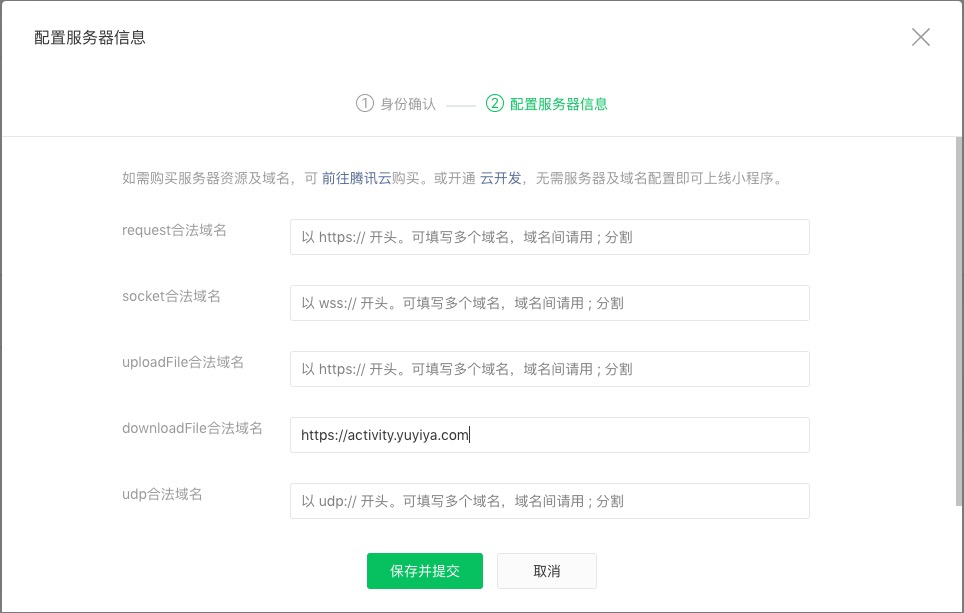
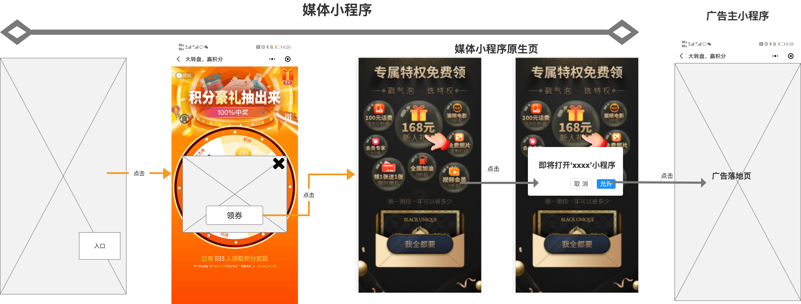

# 媒体接入小程序广告

> 因为微信不允许H5直接打开小程序，所以需要通过小程序原生页面作为中转页面

## 物料准备

我方给媒体提供中转页面的压缩包，媒体解压之后可以看到如下资源

- pages/tuia/index.wxml
- pages/tuia/index.wxss
- pages/tuia/index.json
- pages/tuia/index.js

## 拷贝物料

将解压的物料拷贝到媒体小程序对应的文件夹内

## 添加路由

在app.json中加入中转页面的路由

```javascript
{
  "pages": [
    "pages/tuia/index"
  ],
}
```

## 配置服务器域名

在媒体小程序管理后台服务器域名中添加downloadFile合法域名（互动广告通过wx.getImageInfo接口来发送埋点信息）



## 小程序发布

媒体小程序正常发布之后，互动活动就可以正常发放小程序的广告了。   
体验流程：用户参与活动，用户点击弹层，如果是小程序广告，则打开中转页，用户在中转页发生点击行为，跳转到对应的广告小程序

